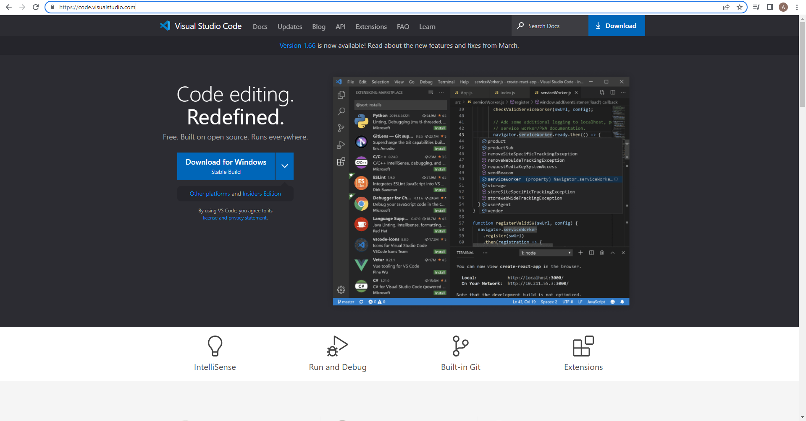
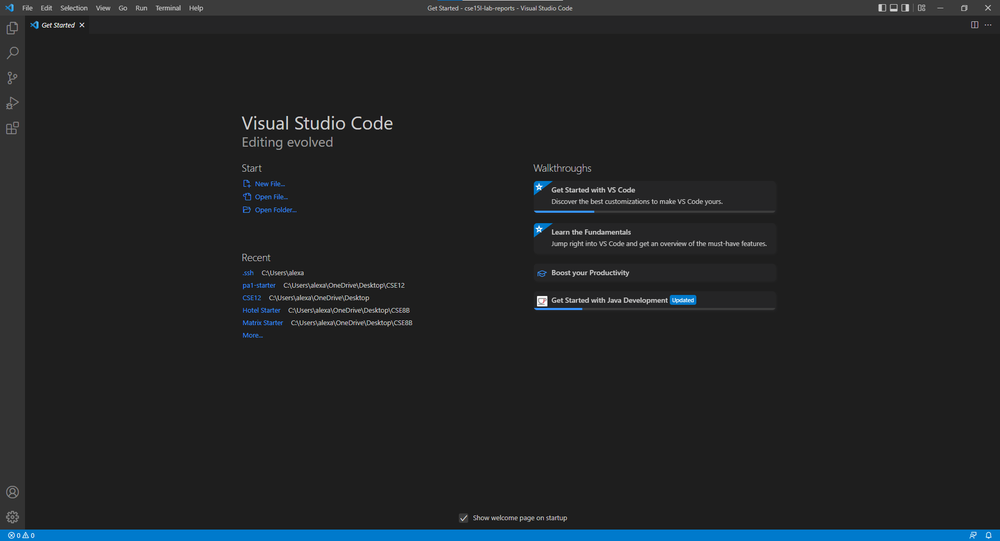
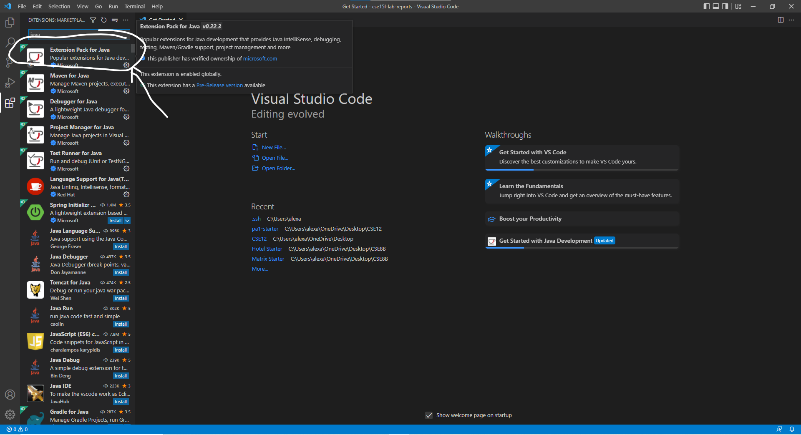

# Lab Report 1 #

## Some simple steps to get started with software tools/techniques ##

1) Install *VSCode* from the [Visual Studio code website](https://code.visualstudio.com/) for your respective Operating System(Windows/Mac/Linux,etc)

After installing *VSCode*, it would look something like this: 

After installing *VSCode*, you would need to search and download the java extension package to code in *Java*. 

